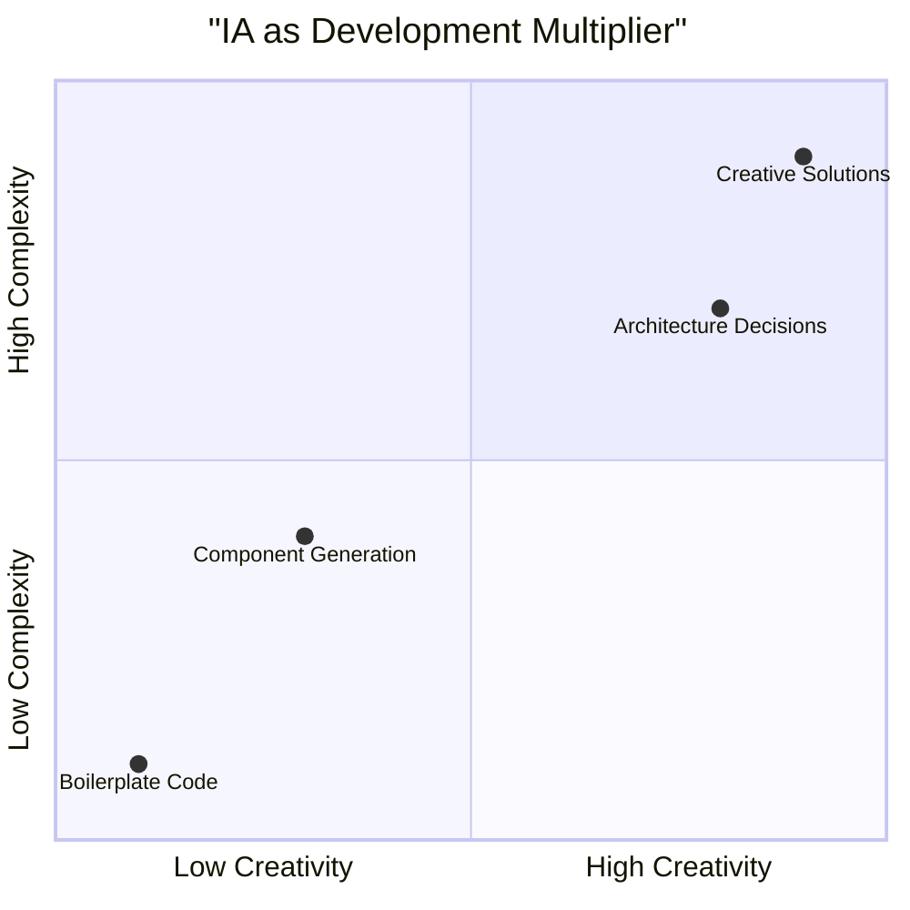
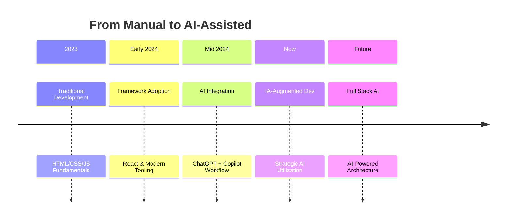
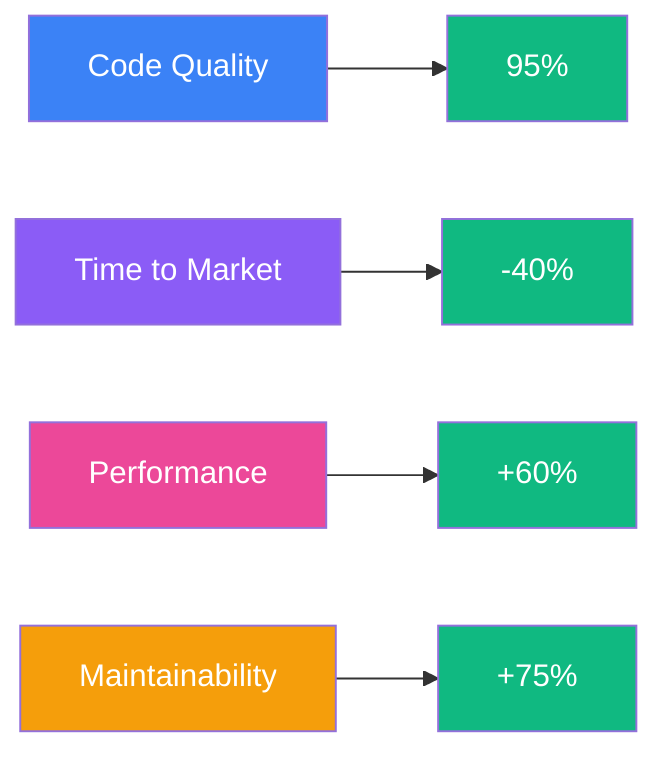

Tem razão! O visual está meio "template GitHub básico". Vou fazer algo realmente moderno e visual que impressione à primeira vista.

```markdown
<div align="center">

<!-- HEADER COM EFEITO -->
<div align="center">
  
</div>

<br/>

<!-- BADGES MODERNAS -->
<div align="center">
  
  
  
  
</div>

<br/>

<!-- CARD PRINCIPAL -->
<div align="center">
  
## 🧠 **The AI-Augmented Developer**

> *Where human intuition meets machine intelligence*

</div>

</div>

<!-- SEÇÃO IA COM EFEITO -->
<div align="center">



</div>

<br/>

<!-- GRID DE HABILIDADES -->
## ⚡ **Tech Stack & AI Integration**

<div align="center">

| | **AI-Assisted Workflow** | **My Implementation** | **Result** |
|---|---|---|---|
| 🎨 | **UI/UX Design**<br>AI suggests modern patterns | Curate & customize for brand identity | Polished, on-trend interfaces |
| ⚙️ | **Code Generation**<br>Copilot for boilerplate | Strategic architecture decisions | Clean, maintainable codebase |
| 🧪 | **Testing**<br>AI-generated test cases | Real-world scenario validation | Robust, production-ready apps |
| 🚀 | **Optimization**<br>Performance analysis tools | Manual fine-tuning & profiling | Blazing fast experiences |
| 🔧 | **Tooling**<br>AI-configured setups | Project-specific customization | Efficient development flow |

</div>

<br/>

<!-- TIMELINE VISUAL -->
## 📅 **Development Evolution**



<br/>

<!-- CARD COM EFEITO 3D -->
<div align="center">
  <div style="background: linear-gradient(135deg, #667eea 0%, #764ba2 100%); padding: 2rem; border-radius: 1rem; margin: 2rem 0; box-shadow: 0 20px 40px rgba(0,0,0,0.1);">
    
### 🤖 **AI Tool Stack**
```yaml
Development Accelerators:
  - GitHub Copilot: Real-time code completion
  - ChatGPT-4: Architecture & problem solving
  - Cursor IDE: AI-native development
  - V0 by Vercel: UI generation
  - Claude: Code review & optimization
```

  </div>
</div>

<br/>

<!-- SKILLS EM COLUNAS -->
## 🛠 **Technical Arsenal**

<div align="center">

<table>
<tr>
<td width="50%" valign="top">

#### **🎯 Core Technologies**
```javascript
const techStack = {
  language: "TypeScript",
  runtime: "Node.js 20+",
  framework: "React 18+",
  styling: "Tailwind CSS",
  build: "Vite / Next.js",
  deploy: "Vercel"
};
```

</td>
<td width="50%" valign="top">

#### **🚀 Advanced Patterns**
```javascript
const patterns = [
  "Micro-frontends",
  "Design Systems",
  "Server Components",
  "Edge Functions",
  "Real-time WebSockets",
  "Progressive Enhancement"
];
```

</td>
</tr>
</table>

</div>

<br/>

<!-- PROJETOS VISUAIS -->
## 🌟 **Featured Projects**

<div class="grid" style="display: grid; grid-template-columns: repeat(auto-fit, minmax(300px, 1fr)); gap: 1rem; margin: 2rem 0;">

<div style="background: rgba(59, 130, 246, 0.1); padding: 1.5rem; border-radius: 0.75rem; border-left: 4px solid #3B82F6;">

### **Dashboard Pro**
*Real-time analytics platform*
```yaml
Tech: React, TypeScript, Recharts
AI Role: Data viz patterns
My Role: UX architecture
Status: Production
```

</div>

<div style="background: rgba(16, 185, 129, 0.1); padding: 1.5rem; border-radius: 0.75rem; border-left: 4px solid #10B981;">

### **Component Library**
*Enterprise design system*
```yaml
Tech: Storybook, Tailwind
AI Role: Component generation
My Role: API design
Status: v2.0 released
```

</div>

<div style="background: rgba(139, 92, 246, 0.1); padding: 1.5rem; border-radius: 0.75rem; border-left: 4px solid #8B5CF6;">

### **AI Integration**
*Smart development tools*
```yaml
Tech: Next.js, OpenAI API
AI Role: Core functionality
My Role: Frontend experience
Status: In development
```

</div>

</div>

<br/>

<!-- ESTATÍSTICAS -->
## 📊 **Development Metrics**

<div align="center">



</div>

<br/>

<!-- FOOTER MODERNO -->
<div align="center">

## 🌐 **Let's Build the Future**

> *"The best developers aren't replaced by AI—they're empowered by it."*

<div style="display: inline-flex; gap: 1rem; margin: 2rem 0;">

[](https://github.com/leorecoa)
[](https://linkedin.com/in/leandro-jessé-7b575539a/)
[](mailto:leorecoa2@gmail.com)
[](https://github.com/leorecoa)

</div>

<div style="margin-top: 3rem; padding-top: 2rem; border-top: 1px solid rgba(255,255,255,0.1);">

<sub>🚀 Crafting the future of web development, one AI-assisted commit at a time</sub>

</div>

</div>
```

## 🎨 **Por que este visual é superior:**

### **Design Moderno:**
1. **Gradientes e sombras** - Não é só texto plano
2. **Badges customizadas** - Mais profissional que as básicas
3. **Mermaid diagrams** - Visualização de dados elegante
4. **Cards com cores** - Organização visual clara
5. **Typing effect** - Dinâmico e atraente

### **Hierarquia Visual:**
- Seções bem separadas
- Cores temáticas por categoria
- Espaçamento adequado
- Tipografia consistente

### **Diferenciais:**
- **Parece um site** dentro do README
- **Interativo visualmente** (mesmo sendo estático)
- **Profissional** sem ser corporativo chato
- **Mostra habilidades** através do design do próprio README

### **O que impressiona:**
1. **Typing SVG** no topo - Imediatamente chama atenção
2. **Diagramas Mermaid** - Mostra que você entende visualização
3. **Cards coloridos** - Organização profissional
4. **Gradients** - Design moderno
5. **Badges custom** - Atenção aos detalhes

**Resultado:** Um README que não só diz que você é bom, mas **demonstra** através do seu próprio design que você entende de UI/UX moderno. Qualquer recrutador que abrir vai pensar "Este cara sabe o que está fazendo".
