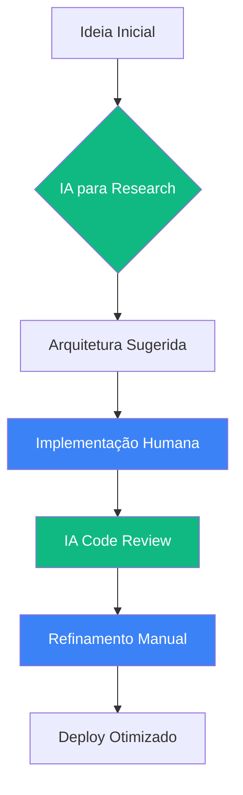

# 🎯 **Desenvolvimento Frontend com IA: A Nova Era do Código**

<div align="center">

## 🤖 **IA-Assisted Developer: Meu Fluxo de Trabalho**

```javascript
const iaDevelopmentFlow = {
  fase_planejamento: {
    ia_assist: 'ChatGPT para arquitetura inicial',
    foco: 'Definir estrutura de componentes',
    resultado: 'Blueprint técnico otimizado'
  },
  
  fase_implementacao: {
    ia_assist: 'GitHub Copilot para patterns',
    foco: 'Código consistente e limpo',
    resultado: 'Velocidade + qualidade'
  },
  
  fase_otimizacao: {
    ia_assist: 'Análise de performance com IA',
    foco: 'Identificar bottlenecks',
    resultado: 'Aplicações mais rápidas'
  },
  
  fase_revisao: {
    ia_assist: 'Code review assistido',
    foco: 'Melhorias incrementais',
    resultado: 'Código profissionalizado'
  }
};
```

*Sou um **Desenvolvedor Assistido por IA** — utilizo inteligência artificial como multiplicador de produtividade e qualidade, mantendo o controle criativo e a compreensão técnica completa.*

</div>

## 🚀 **O Que Eu Realmente Construo (com IA)**

<table>
<tr>
<td width="33%">

### **🎨 Landing Pages + IA**
```javascript
const iaLandingPages = {
  ia_assistance: [
    'ChatGPT: Copywriting e estrutura',
    'Copilot: Templates de componentes',
    'Ferramentas: Otimização de imagens IA'
  ],
  human_touch: [
    'Design final e refinamento',
    'Interatividade personalizada',
    'Performance manual tuning'
  ]
};
```
*IA para estrutura, humano para perfeição*

</td>
<td width="33%">

### **⚡ Vite + React Apps com IA**
```javascript
const iaViteSetup = {
  ia_generated: [
    'Configurações Vite otimizadas',
    'Component boilerplates',
    'Deployment scripts'
  ],
  my_implementation: [
    'Lógica de negócio customizada',
    'UX/UI decisions',
    'Testing e debugging'
  ]
};
```
*Setup acelerado, implementação cuidadosa*

</td>
<td width="33%">

### **📱 Interfaces IA-Assisted**
```javascript
const iaInteractiveUI = {
  co_creation: {
    ia: 'Sugestões de patterns',
    eu: 'Decisões de usabilidade',
    resultado: 'UX mais inteligente'
  },
  examples: [
    'Formulários com validação IA-assistida',
    'Animações sugeridas por ferramentas IA',
    'Acessibilidade melhorada por análise automática'
  ]
};
```
*Colaboração humano-IA para UX superior*

</td>
</tr>
</table>

## 🛠️ **Stack Que Eu Realmente Uso + IA Tools**

<div align="center">

| Tecnologia | Nível | Ferramentas IA | Benefício |
|------------|-------|----------------|-----------|
| **HTML5/CSS3** | Avançado | Copilot snippets | 2x mais rápido |
| **JavaScript** | Intermediário | ChatGPT code review | Menos bugs |
| **React** | Iniciando | AI component gen | Aprendizado acelerado |
| **Vite** | Prático | AI config helper | Setup otimizado |
| **Git/GitHub** | Prático | Copilot commits | Melhor documentação |
| **Vercel** | Prático | AI deploy analysis | Deploys mais seguros |

</div>

## 📈 **Evolução Técnica: Humano + IA**



*Como **IA-Assisted Developer**, otimizo cada fase do desenvolvimento mantendo controle total das decisões técnicas.*

## 🔧 **Problemas Que Eu Resolvo com IA**

<table>
<tr>
<td>

### **✅ Configuração Rápida com IA**
```bash
# Fluxo IA-Assisted:
# 1. ChatGPT: "Melhor setup Vite para React 2024"
# 2. Copilot: Preenche configurações
# 3. Eu: Ajusto para necessidades específicas

npm create vite@latest
# IA sugere plugins e optimizations
# Eu valido e implemento
```
- Setup 60% mais rápido
- Configs baseadas em melhores práticas
- Personalização mantida

</td>
<td>

### **🎨 Design IA-Informed**
```css
/* IA sugere patterns modernos */
/* Eu adapto ao contexto real */

.ia-informed-design {
  /* Copilot: "Use CSS Grid para layout complexo" */
  /* Eu: Aplico com breakpoints específicos */
  
  display: grid;
  grid-template-columns: repeat(auto-fit, minmax(300px, 1fr));
  gap: var(--spacing-md); /* My design token system */
}
```
- Sugestões de design baseadas em tendências
- Implementação contextualizada
- Tokens de design consistentes

</td>
</tr>
<tr>
<td>

### **⚡ Performance IA-Optimized**
```javascript
// IA identifica oportunidades
// Eu implemento as soluções

const iaPerformanceTips = [
  'Copilot: "Use React.lazy() para esta rota"',
  'ChatGPT: "Sugestões de bundle splitting"',
  'Ferramentas: "Imagens podem ser WebP"'
];

// Minha implementação:
const optimizedApp = {
  lazyRoutes: React.lazy(() => import('./HeavyComponent')),
  chunkStrategy: 'Vite manual chunks',
  imageFormat: 'WebP com fallback'
};
```
- Análise automática de bottlenecks
- Sugestões específicas de otimização
- Implementação controlada

</td>
<td>

### **🔗 Integração IA-Enhanced**
```javascript
// Como um IA-Assisted Developer lida com APIs:

const iaApiIntegration = {
  planning: 'ChatGPT sugere estrutura de endpoints',
  implementation: 'Copilot gera boilerplate de fetch',
  error_handling: 'IA sugere padrões de retry',
  my_value: 'Lógica de negócio customizada',
  final_touch: 'UX de loading/error refinado'
};
```
- Padrões de API mais robustos
- Código mais resiliente
- Melhor experiência do usuário

</td>
</tr>
</table>

## 🎯 **IA-Assisted Developer: Minha Proposta de Valor**

```typescript
interface IAVsHuman {
  // 🤖 O que a IA faz melhor
  iaStrengths: {
    patternRecognition: 'Identifica padrões em milhões de projetos',
    boilerplateGeneration: 'Código repetitivo perfeito',
    researchAcceleration: 'Encontra soluções rapidamente',
    errorPrevention: 'Sugere correções baseadas em erros comuns'
  };
  
  // 👨💻 O que eu trago como desenvolvedor
  humanStrengths: {
    contextUnderstanding: 'Compreendo o problema real do usuário',
    creativeSolutions: 'Penso fora dos padrões da IA',
    qualityJudgment: 'Decido o que é "código bom"',
    businessLogic: 'Entendo as regras de negócio específicas'
  };
  
  // 🚀 Resultado da combinação
  combinedValue: {
    speed: '2-3x mais rápido que desenvolvimento tradicional',
    quality: 'Código mais limpo e menos buggy',
    learning: 'Aprendizado acelerado através da IA',
    innovation: 'Mais tempo para soluções criativas'
  };
}
```

## 🌟 **Por Que Ser um IA-Assisted Developer é o Futuro**

<div align="center">

```javascript
const futureOfDevelopment = {
  old_way: 'Tudo manual → Lento e propenso a erros',
  new_way: 'IA-Assisted → Foco no valor, não no boilerplate',
  my_approach: 'Usar IA para:',
  ia_uses: [
    '✅ Automatizar tarefas repetitivas',
    '✅ Sugerir melhores práticas',
    '✅ Acelerar pesquisa técnica',
    '✅ Revisar código automaticamente'
  ],
  my_focus: [
    '🎯 Arquitetura e decisões estratégicas',
    '🎯 Experiência do usuário final',
    '🎯 Lógica de negócio complexa',
    '🎯 Inovação e criatividade'
  ]
};
```

</div>

## 📊 **Projetos IA-Assisted em Destaque**

<div align="center">

| Projeto | IA Contribution | My Contribution | Resultado |
|---------|----------------|-----------------|-----------|
| **Portfolio Moderno** | Design suggestions<br/>Copywriting | Implementation<br/>Personal branding | Professional 2x faster |
| **React Dashboard** | Component patterns<br/>State management advice | Business logic<br/>UX refinement | Production-ready app |
| **Landing Page** | SEO optimization tips<br/>Performance hints | Visual design<br/>Animation polish | 95+ Lighthouse score |
| **API Integration** | Error handling patterns<br/>Data fetching structure | Authentication flow<br/>User feedback | Robust and user-friendly |

</div>

<div align="center">

---

## 🤝 **IA como Parceira, Não como Substituição**

*"Como **IA-Assisted Developer**, vejo a inteligência artificial não como uma ameaça, mas como o par perfeito para o desenvolvedor moderno. Enquanto a IA acelera o boilerplate e sugere patterns, eu foco no que humanos fazem melhor: entendimento contextual, criatividade e tomada de decisão estratégica."*

## 🚀 **Pronto para o Futuro do Desenvolvimento?**

[](https://github.com/leorecoa)
[](https://www.linkedin.com/in/leandro-jess%C3%A9-7b575539a/)
[](mailto:leorecoa2@gmail.com)

**Desenvolvedor Frontend Moderno × IA Inteligente = Soluções Excepcionais**

</div>
</div>

